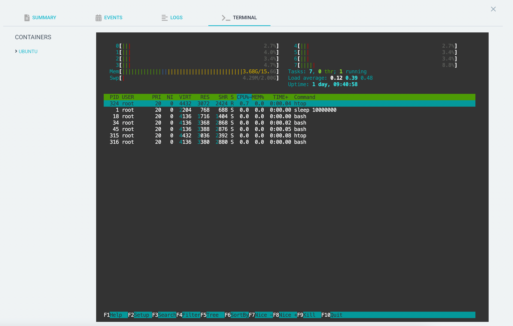
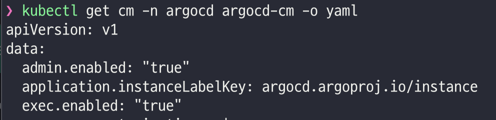
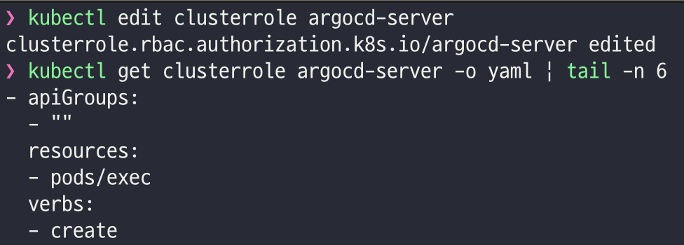

## Description

- ArgoCD Web-based Terminal 활성화 후 사용 방법을 정리한다.
- ArgoCD Web-based Terminal은 ArgoCD UI에서 제공하는 터미널 기능이다.
- ArgoCD를 통해 Pod에 접속하여 명령어를 실행할 수 있다.

## ArgoCD Web-based Terminal 활성화 방법
- ConfigMaps을 수정하여 활성화한다.

- exec.enabled 값을 true로 변경하면 Pod Detail 화면에서 Terminal 버튼이 활성화된다.

- ClusterRole 아래에 참고 링크의 `Enabling the terminal`항목의 2번 코드를 추가한다.
- 이후 ArgoCD UI에서 Terminal 메뉴를 클릭하면 Pod에 접속할 수 있다.

## 참고
- [Argocd Web-based Terminal](https://argo-cd.readthedocs.io/en/stable/operator-manual/web_based_terminal/)

