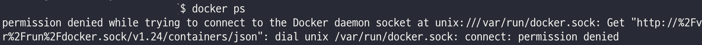

## Docker sudo 없이 일반 유저에서 사용하기
docker를 사용하다보면 sudo를 사용해야하는 번거로움이 있다.
이를 해결하기 위해 일반 유저에서도 docker를 사용할 수 있도록 설정해보자.



#### 1. docker 그룹 생성 (없다면 생성 필요)
```bash
sudo groupadd docker
```

#### 2. docker 그룹에 현재 사용자 추가
```bash
sudo usermod -aG docker [username]
```

#### 3. docker 그룹에 현재 사용자 추가 확인
```bash
cat /etc/group | grep docker
# 실행결과
# docker:x:984:[username]
```

#### 4. docker 재시작
```bash
sudo service docker restart
```

#### 5. ssh 재접속 후 docker 명령어 실행
- 재접속 하지 않을 경우 실행되지 않을 수 있음
```bash
docker ps
# 실행결과
# CONTAINER ID   IMAGE     COMMAND   CREATED   STATUS    PORTS     NAMES
```


