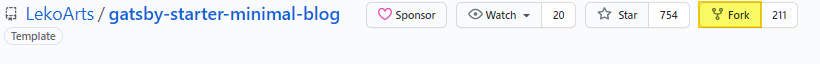
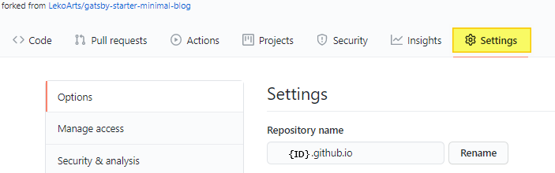
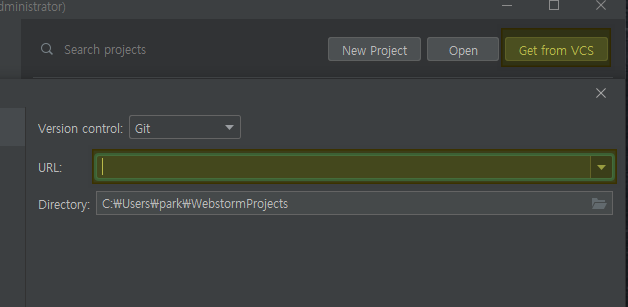
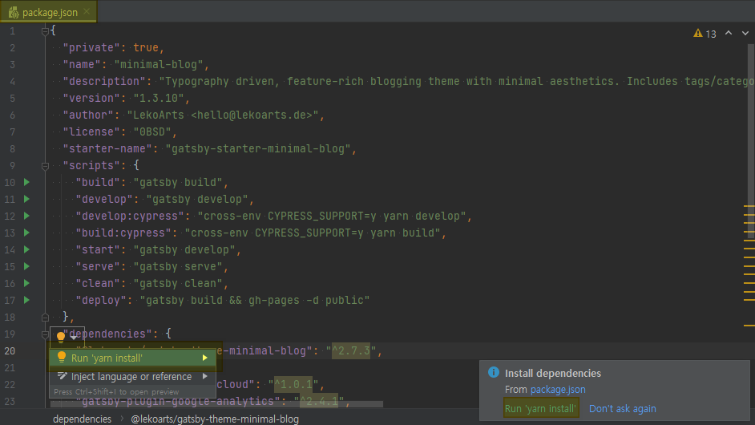
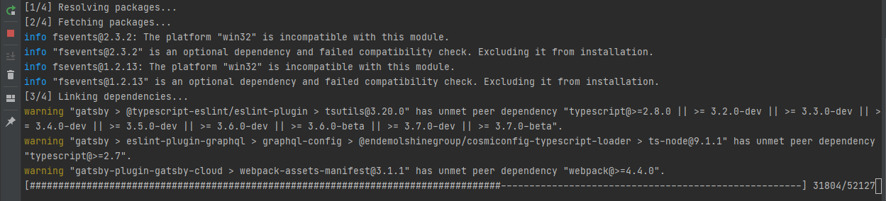
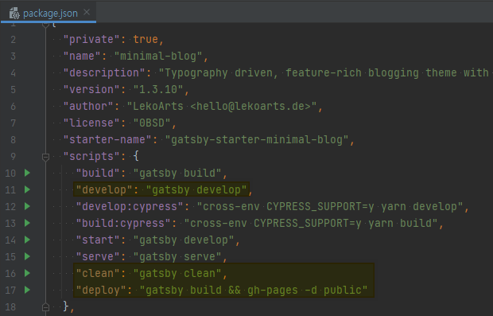
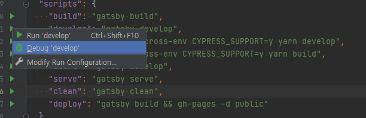
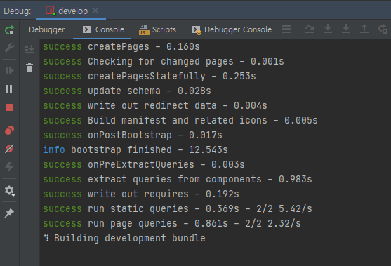
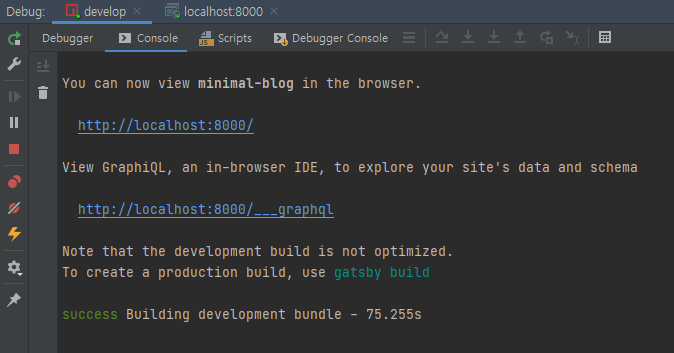
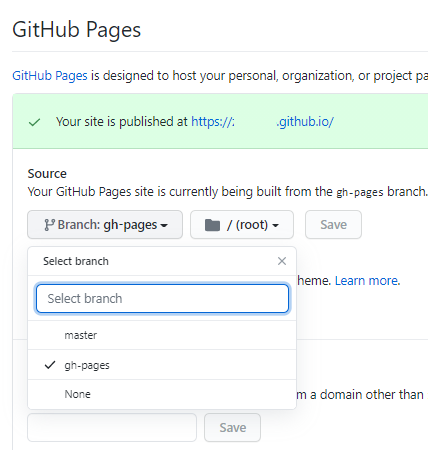

> ## 1. Gatsby 템플릿 선택
>
> - [**Link**](https://www.gatsbyjs.com/starters) 에서 원하는 테마를 선택
> - gatsby-starter-minimal-blog를 선택하여 생성함
> - 여러 형태의 테마가 많으나 react 기반의 테마를 선택함 (Gatsby, Jekyll, Hugo, Next.js 등 많음)
> -   Fork를 클릭하여 로그인한 아이디로 Repository 복사
> 

> ## 2. Github 환경설정
> 
> - \{ID}.github.io 형식으로 입력
> - Repository name을 blog로 입력할경우 \{ID}.github.io/blog 로 접속이 됨


> ## 3. WebStorm 에디터 환경설정
> 
> - Get from VCS 클릭 후 URL에 복사된 Repository url를 입력함
> - git clone 과 같은 과정
>
> 
> - gatsby 테마의 플러그인 관리는 npm과 yarn으로 관리하는듯 하다. 이 테마에선 yarn으로 관리.
>
> 
> - 위와 같이 자동으로 필요한 플러그인을 모두 설치해준다.
>
> 
> - develop : 로컬에 블로그는 띄우는 가장 많이 쓰이는 명령어, 배포하기 전에 로컬에서 글을 확인하는 용도
> - clean : 캐쉬 및 빌드된 소스를 정리
> - > - deploy : 테마에 기본으로는 없는 스크립트, 빌드된 소스를 Github Pages에 commit하는 용도로 사용
> > ```json
"dependencies": \{
    ...
    "gh-pages": "^3.1.0",
    ...
},
> > ```
> > - dependencies 항목에 위와 같이 추가하고 설치가 되어있어야 한다.

>
> 
> - Debug로 실행한건 습관.... Run으로 해도 상관 없음
>
> 
> 
> - 로컬 환경에서 정상적으로 실행됨
> - port를 변경하고 싶다면 develop 스크립트를 gatsby develop -p 8001 로 변경하면 가능
> - 블로그 글 작성은 content/posts 의 예제로 확인(Markdown으로 작성됨)

> ## 4. Github Pages 배포
> - package.json 의 deploy 스크립트를 실행
> - 실행하게 되면 public 폴더에 commit할 소스를 빌드한 후 gh-pages 브랜치에 commit 함
> 
> - Repository > settings > GitHub Pages 항목에서 Select branch를 gh-pages로 변경
> - master 브랜치는 본래의 소스를 commit, 빌드된 소스는 gh-pages 브랜치에 commit 하고 이미지와 같이 선택하여 주면 Github Pages에 소스가 배포가 된다(배포까지는 시간이 조금 걸림...)
> - -b 옵션을 지정할 경우 원하는 브랜치에 commit 가능(gatsby build && gh-pages -d public -b test_branch)
