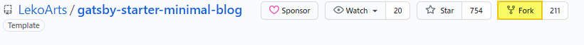

> ## Gatsby 템플릿 선택
>
> - [**링크**](https://www.gatsbyjs.com/starters) 에서 원하는 테마를 선택
> - gatsby-starter-minimal-blog를 선택하여 생성
>
> 여러 형태의 테마가 많으나 react 기반의 테마를 선택함 (Gatsby, Jekyll, Hugo, Next.js 등 많음)
> 

    > ## This is a header.
    > 1. This is the first list item.
    > 2. This is the second list item.
    >
    > Here's some example code:
    >
    >     Markdown.generate();