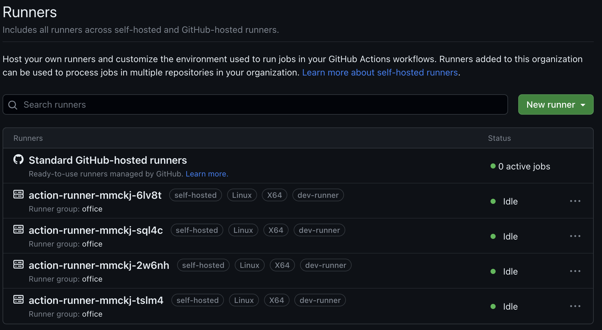

## GitHub Action Controller Runner 란?
> - GitHub Action Controller Runner는 GitHub Action을 실행하기 위한 러너입니다.
> - GitHub Action을 실행하기 위해서는 GitHub에서 제공하는 러너를 사용하거나, 직접 러너(self-hosted)를 구축하여 사용할 수 있습니다.
> - GitHub에서 제공하는 러너는 무료로 사용할 수 있지만, 제한된 자원을 사용하게 됩니다. (1달에 2000분의 실행시간, 10GB의 저장공간)
> - GitHub Action Controller Runner(ARC)는 GitHub에서 제공하는 러너와 동일한 기능을 제공하며, 자원을 제한받지 않고 사용할 수 있습니다.
> - GitHub Action Controller Runner(ARC)는 GitHub Action을 실행하기 위한 러너이기 때문에, GitHub Action을 실행하기 위해서는 GitHub Action Controller Runner를 설치해야 합니다.
> - [GitHub - Action Controller Runner 링크](https://github.com/actions/actions-runner-controller)

## GitHub Action Controller Runner 설치
- [GitHub - Action Controller Runner 설치 링크](https://github.com/actions/actions-runner-controller/blob/master/docs/installing-arc.md)
- GitHub Action Controller Runner는 Kubernetes에서 동작하는 Pod로 설치되고 실행된다.

### 선행조건
- Kubernetes 클러스터
- Cert-Manger 설치 [Install Link](https://cert-manager.io/docs/installation/helm/)
```bash
# cert-manager repo 추가
helm repo add jetstack https://charts.jetstack.io
helm repo update

# cert-manager 설치
helm install
  cert-manager jetstack/cert-manager
  --namespace cert-manager
  --create-namespace
  --version v1.12.0
  --set installCRDs=true # kubectl apply -f https://github.com/cert-manager/cert-manager/releases/download/v1.12.0/cert-manager.crds.yaml 명령어로 설치 가능하나 helm 설치시 같이 설치하는 것을 권장
```

### 설치
- GitHub Action Controller Runner 설치
```bash
# GitHub Action Controller Runner repo 추가
helm repo add actions-runner-controller https://actions-runner-controller.github.io/actions-runner-controller
helm repo update

# GitHub Action Controller Runner 설치
helm upgrade --install --namespace actions-runner-system --create-namespace --timeout "600s" --debug -f values.yaml \
             --wait actions-runner-controller actions-runner-controller/actions-runner-controller
```
  - commands 옵션 설명
    - `--namespace actions-runner-system` : 설치할 namespace 지정
    - `--create-namespace` : namespace가 없을 경우 생성
    - `--timeout "600s"` : 설치 timeout 시간 지정
    - `--debug` : 설치 과정 로그 출력
    - `-f values.yaml` : 설치시 사용할 values.yaml 파일 지정
      - values.yaml 작성법 [values.yaml Docs](https://github.com/actions/actions-runner-controller/blob/master/charts/actions-runner-controller/README.md)
      - `authSecret.create: false` : 초기 설치시 true로 변경해야 Secret이 생성 되고 오류가 발생하지 않음
      - 인증키 발급 방법 및 인증키 작성법
        - [GitHub - Action Controller Runner 인증키 발급 링크](https://github.com/actions/actions-runner-controller/blob/master/docs/authenticating-to-the-github-api.md)
        ```yaml
        # 링크에서 인증키 발급 후 아래와 같이 작성
        github_app_id: "${APP_ID}"
        github_app_installation_id: "${INSTALLATION_ID}"
        github_app_private_key: |
          ${PRIVATE_KEY}
        ```
    - `--wait` : 설치 완료까지 대기

## Self-hosted runner 생성
- GitHub Action Controller Runner 설치 후, GitHub Action을 실행하기 위한 Self-hosted runner를 생성해야 한다.[Docs Link](https://github.com/actions/actions-runner-controller/blob/master/docs/deploying-arc-runners.md)
```yaml
# runnerdeployment.yaml
apiVersion: actions.summerwind.dev/v1alpha1
kind: RunnerDeployment
metadata:
  name: action-runner
  namespace: actions-runner-system
spec:
  replicas: 2
  template:
    spec:
      labels:
        - dev-runner # runner를 구분하기 위한 label - GitHub Action에서 실행될 runner를 선택하기 위해 사용
      nodeSelector:
        kubernetes.io/hostname: node01 # 특정 노드에 runner를 배포하기 위한 설정 - 주석시 모든 노드에 배포
      organization: mumoshu/actions-runner-controller-ci
```
- 캐싱이 필요한 경우 Volume을 지정하기 위해서 [이곳](https://github.com/actions/actions-runner-controller/blob/master/docs/using-custom-volumes.md)을 참고하여 설정
- runnerdeployment.yaml 파일을 생성 후, 아래 명령어로 배포
  ```bash
  kubectl apply -f runnerdeployment.yaml
  ```

## 설치 완료
- 설치가 완료되면 아래와 같이 pod가 생성되고, GitHub Action에서 사용할 수 있다.
  ```bash
  kubectl get pod -n actions-runner-system
  ```
  
  - `Standard GitHub-hosted runners` : GitHub에서 제공하는 러너
  - `action-runner-xxxx` : ARC를 설치하여 생성한 러너, GitHub Action에서 트리거가 발생하면 할당 받아 실행을 처리한다.

## 참고
- [GitHub - Action Controller Runner Docs](https://github.com/actions/actions-runner-controller)

