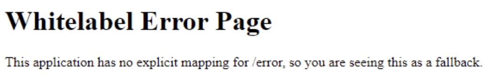

## Nginx Proxy Server 사용시 error page 처리 방법

### 일반적인 Nginx error page 설정
```nginx
server {
    ...
    error_page 404 /404.html;
    location = /404.html {
        root /usr/share/nginx/html;
        internal;
    }
    error_page 500 502 503 504 /50x.html;
    location = /50x.html {
        root /usr/share/nginx/html;
        internal;
    }
    ...
}
```
#### 요약
- 404 에러 발생 처리
  - error_page 404 /404.html; : 404 에러 발생시 /404.html로 이동
  - location = /404.html : /404.html로 이동시 root 디렉토리에서 찾음
  - root /usr/share/nginx/html; : /404.html 파일이 있는 디렉토리
  - internal; : 외부에서 직접 접근 불가
- 50x
  - error_page 500 502 503 504 /50x.html; : 500, 502, 503, 504 에러 발생시 /50x.html로 이동
  - location = /50x.html : /50x.html로 이동시 root 디렉토리에서 찾음
  - root /usr/share/nginx/html; : /50x.html 파일이 있는 디렉토리
  - internal; : 외부에서 직접 접근 불가

### Nginx Proxy Server 사용시 error page 설정
```nginx
server {
    ...
    location / {
        proxy_pass http://10.0.0.22:8080;
        proxy_intercept_errors on;
        error_page 404 /404.html;
        location = /404.html {
            root /usr/share/nginx/html;
            internal;
        }

        error_page 500 502 503 504 /50x.html;
        location = /50x.html {
            root /usr/share/nginx/html;
            internal;
        }
    }
    ...
}
```
#### 요약
- proxy_intercept_errors on; : proxy_pass로 전달된 요청에 대한 에러를 처리
- 404 에러 발생 처리 : 위와 동일하나, proxy_intercept_errors on; 설정이 없으면 동작하지 않음
- 50x 에러 발생 처리 : 위와 동일하나, proxy_intercept_errors on; 설정이 없으면 동작하지 않음
- proxy_intercept_errors on; 설정이 없으면, 404, 50x 에러 발생시 Nginx의 error page가 아닌, proxy_pass로 전달된 서버의 error page가 보여짐

- 즉, 어플리케이션 오류가 노출된다 (ex. Spring 기준으로 Whitelabel Error Page 노출)

