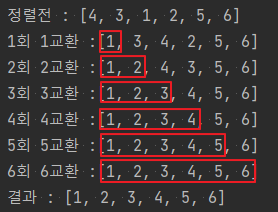

```java
import java.util.Arrays;

class Example03 {
    public static void main(String[] args) {
        int[] arr = new int[]{4, 3, 1, 2, 5, 6,};

        System.out.println("정렬전 : " + Arrays.toString(arr));
        int length = arr.length;
        for (int i = 0, cnt = 1; i < length; i++) {
            int min = i; // 정렬 되지 않은 요소의 가장 작은 인덱스
            for (int j = i + 1; j < length; j++) {
                if (arr[j] < arr[min]) {
                    min = j;
                }
            }

            int temp = arr[i]; // 요소 교환
            arr[i] = arr[min];
            arr[min] = temp;
            System.out.println((i + 1) + "회 " + (cnt++) + "교환 :" + Arrays.toString(arr));

        }

        System.out.println("결과 : " + Arrays.toString(arr));
    }
}
```

- 가장 작은 요소부터 정렬하는 알고리즘
- 정렬되지 않은 요소의 가장 작은 값을 선택한 후 정렬되지 않은 요소와 교환한다.
- 서로 떨어져 있는 요소를 교환하는 것이기 때문에 안정적이지 않음.
- (n² - n) / 2
