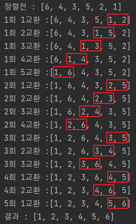

```java
import java.util.Arrays;

class Example02 {
public static void main(String[] args) {
int[] arr = new int[]{6, 4, 3, 5, 2, 1,};

        System.out.println("정렬전 : " + Arrays.toString(arr));
        for (int i = 0; i < arr.length; i++) {
            for (int j = arr.length - 1, cnt = 1; j > i; j--) {
                if (arr[j - 1] > arr[j]) {
                    int temp = arr[j - 1];
                    arr[j - 1] = arr[j];
                    arr[j] = temp;
                }
                System.out.println((i + 1) + "회 " + (cnt++) + "교환 :" + Arrays.toString(arr));
            }
        }
        System.out.println("결과 : " + Arrays.toString(arr));
    }
}

```

- 오름차순 정렬
- 회차 별로 배열 끝의 표시된 값을 기준으로 왼쪽값이 크다면 교환이 된다. 왼쪽값이 작다면 현재를 유지한다.
- 다음 회차가 되면 다시 반복하여 교환하거나 현상을 유지한다.
- 반복하여 정렬이 완료 되면 결과 값처럼 오름차순으로 교환이 완료된다.
